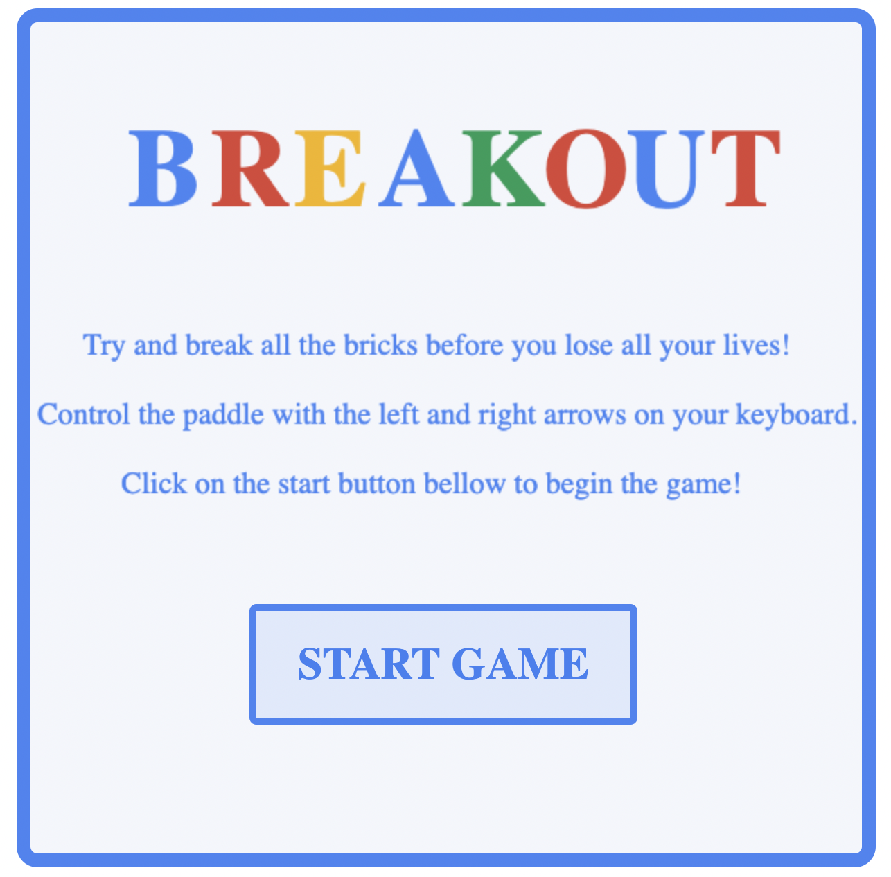
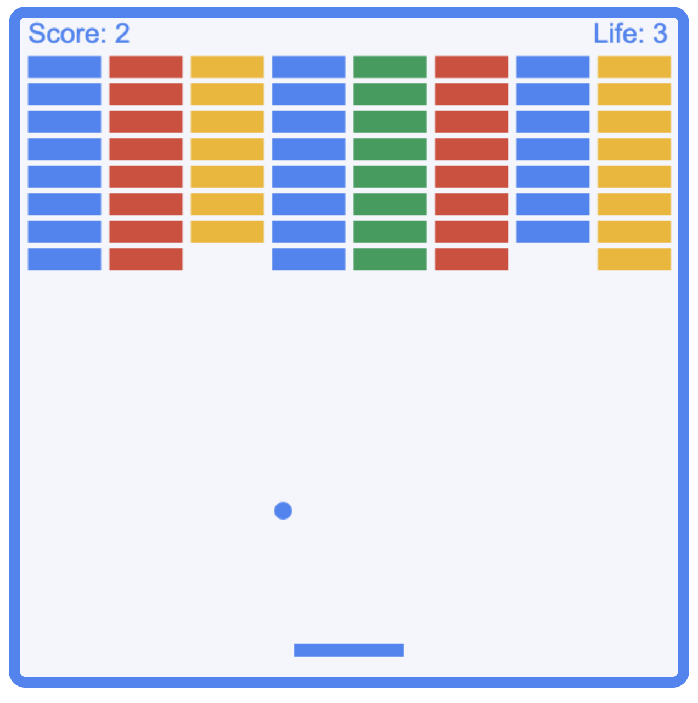
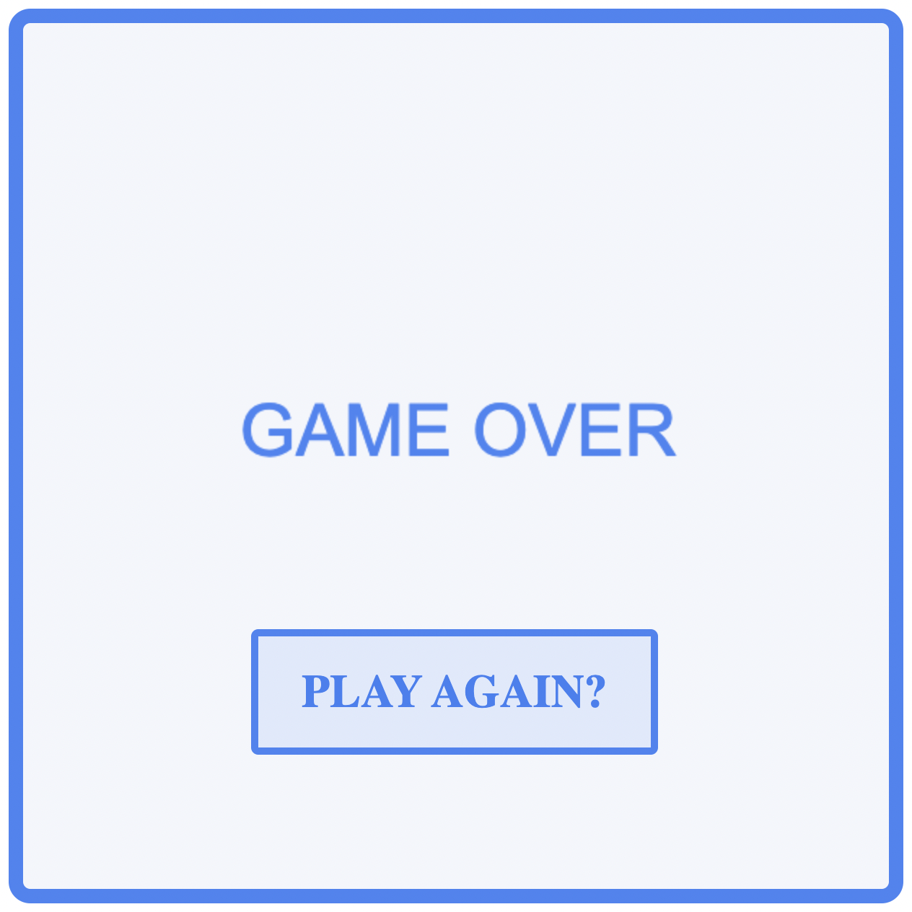

# BREAKOUT for Google Apprenticeship Interview

For this project I was tasked with creating a Breakout game with the folowing parameters:

-Your game should have a single screen with 8 rows of bricks, a paddle, and a ball.  

-If the ball touches the bottom of the screen, you lose a ‘life’. 

-After 5 lives, the game is over.  

-Every time the ball touches a brick, the brick disappears and the score increases.  

-The ball bounces off the paddle, the bricks, and the top, left and right edges of the screen.

The following images are of the game which can be played at [HERE](https://nschloesserm.github.io/breakout/) https://nschloesserm.github.io/breakout/

## REFERENCES

- https://www.w3schools.com/jsref/default.asp
- https://developer.mozilla.org/en-US/
- https://www.includehelp.com/code-snippets/move-object-with-arrow-keys-using-javascript-function.aspx
- https://developer.mozilla.org/en-US/docs/Games/Tutorials/2D_Breakout_game_pure_JavaScript/Track_the_score_and_win

